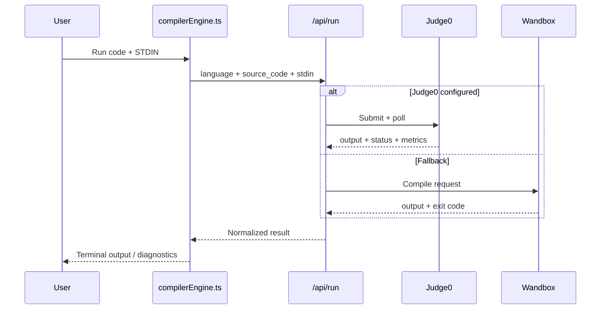

<div align="center">

# ⚡ CodeVault Pro

### AI-Powered Coding, Learning & Collaboration Platform

**Write • Run • Learn • Visualize • Collaborate**

<p>
  A full-stack programming workspace for students, educators, and developers — combining a multi-language compiler, interactive algorithm visualizations, competitive programming tools, classrooms, collaboration, version history, and AI-assisted learning in one platform.
</p>

[](https://react.dev/)
[](https://www.typescriptlang.org/)
[](https://vite.dev/)
[](https://tailwindcss.com/)
[](https://fastapi.tiangolo.com/)
[](https://www.python.org/)
[](https://www.docker.com/)
[](https://vercel.com/)
[](https://render.com/)

**Repository:** [github.com/RupanjanDutta2006/Code](https://github.com/RupanjanDutta2006/Code)

</div>

---

## ✨ Overview

**CodeVault Pro** is designed to bridge the gap between a simple browser code editor, a modern developer workspace, and an interactive computer-science learning environment.

It gives students a focused place to **write and organize code, execute programs, visualize algorithms step by step, practice against test cases, collaborate in real time, manage classroom assignments, and ask for AI-powered help** — without splitting those experiences across multiple tools.

For educators, CodeVault adds structured classrooms, assignments, submissions, leaderboards, and role-aware access. For learners, it turns abstract programming concepts into visual, inspectable execution states.

---

## 🚀 Core Features

| Feature | What it provides |
|---|---|
| **Personal Code Library** | Folder hierarchy, categories, full-text search, tagging, saved programs, and quick access |
| **Multi-Language Compiler** | Execution support for 11 language targets through local/container/cloud execution tiers |
| **Interactive Terminal** | Real-time WebSocket STDIN/STDOUT plus buffered STDIN for serverless/cloud execution |
| **My Class** | Deterministic, step-by-step algorithm simulations synchronized with source-code highlighting |
| **Practice & Check** | Sample + hidden testcase judging with Accepted / Wrong Answer / TLE / Runtime Error verdicts |
| **Classrooms** | Teacher/student workflows, invite codes, assignments, progress tracking, submissions, and leaderboards |
| **Collaborative Playground** | Temporary real-time coding rooms with peer presence, shared editing, cursors, and joint execution |
| **Past Versions** | Immutable program revisions and Monaco-powered side-by-side diffs |
| **AI Assistant** | Code explanation, debugging support, complexity analysis, and non-destructive patch suggestions |
| **Folder / ZIP Import** | Recursive project import with language detection and SHA-256 deduplication |
| **Offline-First Support** | IndexedDB-backed offline queuing and Service Worker asset caching |
| **Creator & Learning Hub** | Curated roadmaps, coding resources, cheat sheets, and community-facing content |

---

## 🧩 Technology Stack

| Layer | Technologies |
|---|---|
| **Frontend** | React 19, TypeScript, Vite |
| **Styling / UX** | Tailwind CSS, Liquid Glass design system |
| **Editor / Diff** | Monaco Editor |
| **Backend API** | FastAPI, Python, Uvicorn |
| **Serverless Execution Gateway** | TypeScript / Vercel Functions |
| **Cloud Execution** | Judge0, Wandbox |
| **Local / Container Execution** | Python subprocess runners, GCC/G++, OpenJDK, Node.js, Go, Rust, Kotlin, SQLite |
| **Realtime** | WebSockets |
| **Persistence** | SQLAlchemy ORM, SQLite, PostgreSQL-compatible `DATABASE_URL` |
| **Authentication** | JWT, password hashing, Firebase-supported auth flows |
| **Analytics / UI Data** | Recharts |
| **Deployment** | Vercel, Render, Docker |

---

## 🏗️ System Architecture

```mermaid
flowchart TB
    U[Student / Teacher / Developer]

    subgraph FE[Frontend — React 19 + TypeScript + Vite]
        UI[Liquid Glass UI + Monaco Editor]
        LEARN[My Class Simulation Engine]
        AUTH[Auth / Offline / Theme Contexts]
        COMP[Universal Compiler Engine]
    end

    subgraph VE[Vercel Serverless]
        RUN[/api/run/]
        PROG[/api/programs/execute/]
        RATE[Rate Limiter]
    end

    subgraph BE[FastAPI Backend]
        REST[REST APIs]
        WSE[/ws/execute/]
        WSP[/ws/playground/{id}/]
        JUDGE[Judge Service]
        AI[AI Assist Service]
        IMPORT[Folder Importer]
        EXEC[Execution Service]
    end

    subgraph CLOUD[Cloud Compiler Providers]
        J0[Judge0]
        WB[Wandbox]
    end

    subgraph DATA[Storage]
        DB[(SQLite / SQLAlchemy)]
        FILES[Sandboxes / Runtime Data]
    end

    U --> UI
    UI --> LEARN
    UI --> AUTH
    UI --> COMP

    COMP --> RUN
    RUN --> RATE
    RATE --> J0
    RATE --> WB

    UI <--> REST
    UI <--> WSE
    UI <--> WSP

    REST --> JUDGE
    REST --> AI
    REST --> IMPORT
    REST --> EXEC
    REST --> DB
    IMPORT --> FILES
```

### Execution Philosophy

CodeVault uses a **multi-tier execution strategy** instead of depending on a single compiler path:

1. **Native subprocess execution** for full backend environments with real time/memory tracking.
2. **Interactive WebSocket execution** for bidirectional terminal I/O.
3. **Cloud compiler gateway** through Judge0 or Wandbox for serverless deployments.
4. **In-browser execution** for supported JavaScript/TypeScript offline scenarios.
5. **Sandboxed HTML preview** for instant browser rendering.

---

## 💻 Supported Languages

| Language | Typical Runtime / Compiler |
|---|---|
| **Python** | CPython |
| **C** | GCC |
| **C++** | G++ / C++17 |
| **Java** | OpenJDK |
| **JavaScript** | Node.js |
| **TypeScript** | Node.js / TypeScript |
| **Go** | Go toolchain |
| **Rust** | Rustc |
| **Kotlin** | Kotlin/JVM |
| **SQL** | SQLite |
| **HTML / CSS** | Sandboxed browser preview |

> Local language toolchains are optional when using the cloud execution path.

---

## 🧠 My Class — Interactive Algorithm Learning

**My Class** transforms algorithms and data structures into deterministic visual simulations. Each learning step captures the active source line, visual state, variable snapshot, explanation, event type, and progressive output.

```mermaid
flowchart LR
    A[Lesson + Input]
    B[Deterministic generateTrace()]
    C[LearningStep Frames]
    D[Playback Engine]
    E[Code Highlight]
    F[Visualizer]
    G[Variables]
    H[Output]
    I[Step Explanation]

    A --> B --> C --> D
    D --> E
    D --> F
    D --> G
    D --> H
    D --> I
```

### Visualizer Types

- **Array Visualizer** — pointers, comparisons, swaps, sorted states
- **Linked List Visualizer** — nodes, links, `head`, `prev`, `curr`, `next`, slow/fast pointers
- **Stack Visualizer** — LIFO state, push/pop, top indicator
- **Queue Visualizer** — FIFO state, front/rear tracking
- **Tree Visualizer** — hierarchical SVG rendering and traversal state
- **Graph Visualizer** — BFS/DFS traversal, visited nodes, active edges
- **Recursion Visualizer** — call stack frames, base cases, return propagation

### Interactive Lessons

| Category | Lessons |
|---|---|
| **Sorting** | Bubble Sort, Selection Sort, Insertion Sort |
| **Searching** | Binary Search, Linear Search |
| **Arrays** | Array Reverse / Two Pointers |
| **Linked List** | Reverse Linked List, Middle of Linked List |
| **Stack & Queue** | Stack Push/Pop, Queue Enqueue/Dequeue |
| **Trees** | Binary Tree Traversals |
| **Graphs** | BFS, DFS |
| **Recursion** | Factorial, Fibonacci |

Playback includes stepping, pausing, resetting, preset input selection, timeline scrubbing, and event-aware pacing.

---

## ⚡ Compiler & Terminal

### Buffered Cloud Execution



### Interactive WebSocket Terminal

The FastAPI backend also supports true bidirectional terminal sessions through `/ws/execute`, allowing prompts and user input to be streamed during execution when deployed on an environment that supports persistent WebSockets and subprocess execution.

The execution engine classifies compilation errors, runtime errors, time-limit failures, memory-limit failures, output-limit failures, and user cancellation into normalized terminal states.

---

## 🧪 Practice & Check

The competitive-programming judge executes a student's solution against sample and hidden test cases, normalizes output, aggregates results, and stores the final submission.

Typical verdicts include:

- ✅ **Accepted**
- ❌ **Wrong Answer**
- ⏱️ **Time Limit Exceeded**
- 💥 **Runtime Error**

Hidden test data remains hidden from students while instructors retain access to submission-level diagnostics.

---

## 🏫 Classrooms

CodeVault includes role-aware teacher/student workflows.

### Teachers can

- Create classrooms
- Generate invite codes
- Publish programming assignments
- Inspect student submissions
- Track completion
- Review leaderboards

### Students can

- Join using invite codes
- Solve assigned problems inside the built-in IDE
- Submit solutions for automated checking
- Review their own score and progress

---

## 🤝 Real-Time Collaborative Playground

Collaborative rooms use WebSockets to synchronize coding sessions in real time.

Supported room events include:

- peer join / leave
- shared source updates
- language changes
- live cursor positions
- joint run-code actions
- broadcast execution status and output

---

## 🤖 AI Assistant

CodeVault's AI assistant is built as a **non-destructive learning and debugging aid**.

It can help with:

- program-flow explanations
- algorithm and complexity breakdowns
- compiler/runtime error interpretation
- bug-fix suggestions
- beginner-oriented guidance

The documented provider chain supports configured cloud AI providers with a built-in deterministic fallback. Suggested fixes are presented as diffs and **never overwrite user code until the user explicitly applies the change**.

> AI provider credentials must always be stored securely in backend environment variables — never committed to the repository or exposed in frontend bundles.

---

## 📂 Folder & ZIP Import

The importer supports recursive project ingestion while automatically filtering common generated files and folders such as `node_modules`, `.git`, `__pycache__`, build output, compiled binaries, and caches.

It also provides:

- language/category inference
- folder hierarchy reconstruction
- SHA-256 content hashing
- duplicate detection
- revision-aware imports

---

## 🗂️ Project Structure

```text
CodeVault-Pro/
├── api/                      # Vercel serverless API handlers
│   ├── run.ts
│   ├── execute.ts
│   ├── health.ts
│   └── programs/
│
├── backend/                  # FastAPI application
│   ├── api/                  # REST routes
│   ├── database/             # SQLAlchemy database + seed
│   ├── executor/             # Execution engine / language runners
│   ├── models/               # ORM models
│   ├── schemas/              # Pydantic schemas
│   ├── services/             # AI, analytics, importer, judge, diff
│   ├── tests/                # Backend tests
│   ├── utils/                # Security helpers
│   ├── websockets/           # Interactive terminal + playground
│   ├── config.py
│   └── main.py
│
├── frontend/                 # React + TypeScript + Vite
│   ├── public/
│   └── src/
│       ├── assets/
│       ├── components/
│       ├── context/
│       ├── learning/         # My Class simulation engine
│       ├── pages/
│       ├── services/
│       ├── App.tsx
│       └── main.tsx
│
├── server/                   # TypeScript cloud compiler service
│   ├── compilerService.ts
│   └── index.ts
│
├── data/                     # Runtime DB/cache/sandbox data
├── Dockerfile
├── render.yaml
├── requirements.txt
├── package.json
└── vercel.json
```

---

## 🔐 Security Model

CodeVault's documented security model includes:

- password hashing with Argon2/bcrypt-compatible tooling
- JWT-based authentication
- role-based access control for students, teachers, and creators
- classroom membership guards
- private submission access rules
- process timeouts
- memory caps
- output-size limits
- temporary execution directories
- serverless request rate limiting

### Secret Handling

Never commit real API keys, passwords, access tokens, or production secrets.

Use environment variables and keep `.env` files out of source control.

```env
# Frontend connectivity
VITE_API_URL=https://your-backend.example.com
VITE_WS_URL=wss://your-backend.example.com

# Optional backend AI providers
GEMINI_API_KEY=
OPENAI_API_KEY=

# Backend application configuration
DATABASE_URL=
SECRET_KEY=
```

> Use placeholders only in `.env.example`. Keep all real values in your local environment or deployment platform's secret manager.

---

## 🛠️ Getting Started

### Prerequisites

- **Node.js 18+** — Node.js 20+ recommended
- **Python 3.10+** — Python 3.13 recommended by the project documentation
- **npm**
- Optional local C/C++/Java/Go toolchains if you want native local execution

### 1. Backend

From the project root:

```powershell
python -m venv venv
.\venv\Scripts\Activate.ps1
pip install -r requirements.txt
python -m uvicorn backend.main:app --host 127.0.0.1 --port 8000 --reload
```

Backend development server:

```text
http://127.0.0.1:8000
```

### 2. Frontend

Open another terminal:

```powershell
cd frontend
npm install
npm run dev
```

Frontend development server:

```text
http://localhost:5173
```

---

## ☁️ Deployment

The documented production topology separates the frontend and persistent backend responsibilities:

```text
Vercel
├── React + Vite frontend
└── Serverless compiler gateway

        │ REST / WebSocket configuration
        ▼

Render
└── FastAPI + Uvicorn + Docker
    ├── Persistent WebSockets
    ├── Interactive subprocess execution
    └── Runtime metrics / storage
```

### Render Backend

Deploy the repository as a Docker web service using the included:

```text
Dockerfile
render.yaml
```

### Vercel Frontend

Configure:

```env
VITE_API_URL=https://your-render-service.onrender.com
VITE_WS_URL=wss://your-render-service.onrender.com
```

Then redeploy the frontend.

---

## 🧪 Testing

Backend tests are available under `backend/tests/`.

```powershell
.\venv\Scripts\python -m pytest backend/tests/ -v
```

Before deployment, also run the frontend's available build/lint scripts from `frontend/package.json`.

---

## 🌐 Selected API Surface

| Method | Endpoint | Purpose |
|---|---|---|
| `POST` | `/api/run` | Serverless cloud execution |
| `POST` | `/api/execute` | Standard backend execution |
| `POST` | `/api/execute/stop` | Stop an active execution |
| `POST` | `/api/programs/execute` | Program execution compatibility endpoint |
| `GET` | `/api/health` | Backend health check |
| `POST` | `/api/judge/run-checks` | Execute judge test cases |
| `WS` | `/ws/execute` | Interactive terminal session |
| `WS` | `/ws/playground/{room_id}` | Collaborative coding room |
| `POST` | `/api/ai/explain` | AI-powered code explanation |
| `POST` | `/api/ai/suggest-fix` | AI-powered fix suggestion + diff |

The project also exposes program/library, classroom, assignment, version-history, analytics, authentication, and submission APIs.

---

## 🎨 Frontend Experience

The frontend is built around a responsive **Liquid Glass** design language and includes:

- Monaco-powered coding workspace
- dark/light theme synchronization
- responsive navigation
- visual execution states
- analytics views
- interactive learning panels
- code/output/simulation layouts
- offline-aware context management

---

## 👥 Team

| Contributor | Role |
|---|---|
| **Rupanjan Dutta** | Core Engineer |
| **Souvik Saha** | UI/UX & Co-Developer |

---

## 🤝 Contributing

Contributions that improve learning quality, compiler reliability, visualizations, accessibility, performance, documentation, or security are welcome.

A good contribution flow is:

1. Create a focused branch or working copy.
2. Make a small, well-scoped change.
3. Run the relevant build/tests.
4. Document behavior changes.
5. Open a pull request for review.

Please avoid committing generated dependencies, local caches, `.env` files, secrets, databases, or temporary execution artifacts.

---

## 📌 Notes for Developers

- Cloud execution and interactive subprocess execution are different paths; test both when changing compiler logic.
- Buffered STDIN and WebSocket STDIN must remain separate but consistent experiences.
- My Class simulations are deterministic learning traces — not AI-generated execution guesses.
- Hidden judge test cases should remain private to students.
- AI-generated patches must remain opt-in and non-destructive.
- Secrets belong in backend/deployment environment variables, never in committed source.

---

## 📄 License

No license information was specified in the provided project architecture documentation. Add a `LICENSE` file before publishing the project under a specific open-source license.

---

<div align="center">

### Built to make programming more visual, collaborative, and easier to learn.

**CodeVault Pro** — Code • Run • Learn • Visualize • Collaborate

</div>
