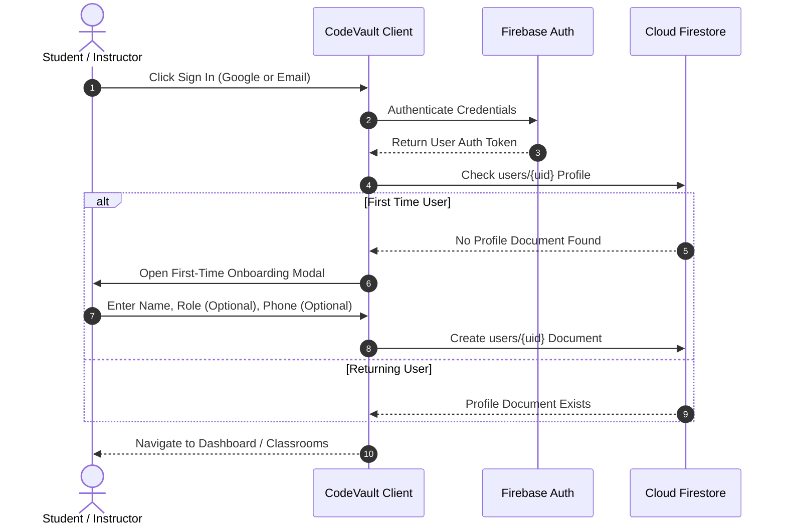
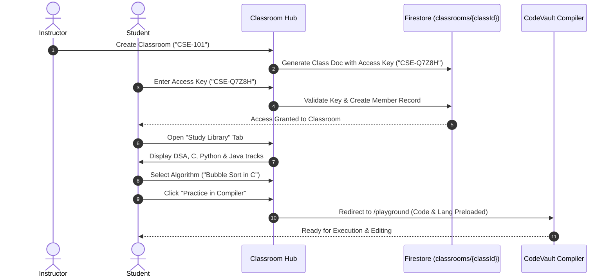

# ⚡ CodeVault Pro

<div align="center">

**A modern, mobile-first cloud IDE, classroom management platform, and computer science study library.**

Write • Run • Learn • Visualize • Collaborate

[](https://react.dev/)
[](https://www.typescriptlang.org/)
[](https://vite.dev/)
[](https://tailwindcss.com/)
[](https://firebase.google.com/)
[](https://fastapi.tiangolo.com/)
[](https://www.python.org/)
[](https://vercel.com/)
[](LICENSE)

**Live Production Application:** [https://codevault-pro-weld.vercel.app/](https://codevault-pro-weld.vercel.app/)  
**Primary Repository:** [https://github.com/S0u1k/Code-Vault-Pro](https://github.com/S0u1k/Code-Vault-Pro)

</div>

---

## 📖 Overview

**CodeVault Pro** is an all-in-one educational coding workspace designed for students, educators, and software engineers. It unifies high-performance multi-language code execution, interactive algorithm visualizations, collaborative classrooms, structured study curricula, and AI-assisted learning into a single mobile-first web application.

Traditional developer tools are often fragmented: learners write code in one editor, submit homework on another portal, read algorithm notes from drive links, and debug syntax errors on external forums. CodeVault Pro solves this by delivering an integrated ecosystem where users can:
- **Write & Run Code:** Test solutions instantly across 11 programming languages with interactive terminal STDIN/STDOUT.
- **Join Academic Classrooms:** Enroll via unique Class Access Keys, access teacher announcements, explore shared code vaults, and submit assignments.
- **Master Data Structures & Algorithms (DSA):** Explore topic-by-topic algorithm implementations across C, Python, and Java with one-click **Practice in Compiler** execution.
- **Learn Visually:** Step through deterministic execution traces in *My Class* interactive simulations.
- **Access Offline:** Download and store lecture notes and study materials in local browser storage for offline review.

---

## 🚀 Key Features

### 💻 Multi-Language Online Compiler & Playground
- **11 Language Targets:** Full compilation and execution support for C, C++, Python, Java, JavaScript, TypeScript, Go, Rust, Kotlin, SQL, and HTML.
- **Interactive Terminal:** Dual execution support with WebSocket-based real-time interactive terminal sessions and serverless execution endpoints.
- **Judge Evaluation Engine:** Run custom sample and hidden testcases with instant verdicts (*Accepted*, *Wrong Answer*, *Time Limit Exceeded*, *Runtime Error*).
- **Monaco Code Editor:** Professional editor experience with intelligent syntax highlighting, multi-tab workflows, line folding, and dark/light themes.

### 🧠 Classroom Study Library
- **Dedicated DSA Track:** Organized by algorithm category (Sorting, Searching, Linked Lists, Stacks & Queues, Trees, Graphs, Competitive Programming).
  - Multi-language implementations: Compare **C**, **Python**, and **Java** code side-by-side.
  - **Practice in Compiler Button:** Instantly loads the algorithm snippet directly into the playground compiler.
- **Top-Level Language Subjects:** Dedicated modules for **C Programming** (Pointers, Memory Allocation with `malloc`/`free`), **Python** (OOP, Comprehensions), and **Java**.
- **Verified References & Offline Downloads:** Direct links to source repositories and document drives, plus one-click offline saving to browser IndexedDB storage.
- **Teacher Content Uploads:** Classroom instructors can publish custom theory, code, assignments, and external resources synced in real time via Firestore.

### 🏫 Classroom & Academic Collaboration
- **Dynamic Access Keys:** Instructors create classrooms and generate unique, shareable keys (e.g., `CSE-Q7Z8H`).
- **Enrollment Controls:** Teachers can lock/unlock enrollment, regenerate access keys, and manage student rosters.
- **Announcements & Materials:** Real-time notice boards with pinned announcements, downloadable lecture documents, and homework assignment management.
- **Assignment Submission Pipeline:** Students submit source code solutions with instant submission timestamps and instructor reviews.

### 🤖 CodeVault AI Assistant
- **Context-Aware Assistance:** Integrated coding companion providing code explanations, complexity analysis, and syntax troubleshooting.
- **Intelligent Debugging:** Diagnostic assistance explaining compiler errors and suggesting non-destructive patches.
- **Clean Interface:** Non-intrusive collapsible drawer with floating launcher and code preview capabilities.

### 🎬 Interactive Visualizations (*My Class*)
- **Deterministic Simulations:** Step-by-step visual execution traces of core algorithms (Sorting, Graph traversals, Dynamic Programming) synchronized with active code line highlights.
- **Zero Hallucination:** Visualizations are powered by deterministic algorithm execution states rather than generative guesses.

### 🔐 Authentication & First-Time Onboarding
- **Supported Providers:** Google Authentication and Email + Password login.
- **First-Time Profile Setup:** Mandatory Name onboarding modal for new users with optional Phone and Role selection (*Student* / *Professor*).
- **Session Persistence:** Fast client-side session hydration with Firebase Auth state management.

### 📱 Mobile-First Liquid-Glass Architecture
- **Instant Dark Shell:** Raw HTML `#060608` skeleton shell prevents initial white flashes on mobile connections.
- **Code-Split Lazy Routes:** Modular route bundles with `React.lazy()` for rapid cold loads (~111 kB initial JS).
- **Responsive Viewport Control:** Fixed-layer liquid-glass ambient background with isolated viewport modal portals and mobile navigation bar.

---

## 🛠️ Technology Stack

| Layer | Technologies |
|---|---|
| **Frontend Framework** | React 19, TypeScript, Vite |
| **Styling & UI** | Tailwind CSS 3.4, Lucide Icons, Liquid Glass Theme System |
| **Code Editor** | Monaco Editor (`@monaco-editor/react`) |
| **Authentication** | Firebase Authentication (Google OAuth, Email/Password) |
| **Database & Realtime** | Firebase Firestore (Realtime listeners, security rules) |
| **Offline Storage** | Browser IndexedDB API (`studyMaterialsStorage`) |
| **Charts & Metrics** | Recharts |
| **Serverless API** | Vercel TypeScript Serverless Functions (`/api/*`) |
| **Backend Service** | FastAPI (Python 3.10+), Uvicorn, SQLAlchemy |
| **Hosting & CDN** | Vercel Edge Network |

---

## 🏗️ Architecture Overview

```mermaid
flowchart TD
    subgraph Client["Frontend Client (React 19 + TypeScript + Vite)"]
        UI["Liquid Glass UI & Startup Shell"]
        Monaco["Monaco Code Editor"]
        ClassroomUI["Classroom & Study Library"]
        Visualizer["My Class Visualizer"]
        OfflineCache["IndexedDB Storage"]
    end

    subgraph Firebase["Firebase Cloud Services"]
        Auth["Firebase Authentication (Google & Email)"]
        Firestore["Cloud Firestore (Classrooms, Library, Users)"]
        Storage["Firebase Storage"]
    end

    subgraph Serverless["Vercel Serverless Gateway"]
        RunAPI["/api/run (Cloud Execution)"]
        HealthAPI["/api/health"]
        AIProxy["/api/ai/* (CodeVault AI Gateway)"]
    end

    subgraph Backend["FastAPI Backend (Optional Dedicated Tier)"]
        FastAPI["FastAPI REST & WebSocket Server"]
        InteractiveRunner["Interactive Subprocess Execution"]
        JudgeEngine["Judge & Testcase Evaluator"]
        SQLiteDB["SQLite / PostgreSQL ORM"]
    end

    UI --> Auth
    UI --> Firestore
    ClassroomUI --> Firestore
    ClassroomUI --> OfflineCache
    Monaco --> RunAPI
    Monaco --> InteractiveRunner
    UI --> AIProxy
    FastAPI --> JudgeEngine
    FastAPI --> SQLiteDB
```



---

## 📂 Project Structure

```text
Code-Vault-Pro/
├── api/                       # Vercel Serverless API functions
│   ├── ai/                    # CodeVault AI serverless routes
│   ├── programs/              # Program execution routes
│   ├── execute.ts             # Direct code execution handler
│   ├── health.ts              # API health check endpoint
│   └── run.ts                 # Multi-language execution runner
├── backend/                   # FastAPI backend services
│   ├── api/                   # REST API routers (classrooms, judge, auth)
│   ├── database/              # SQLAlchemy database configuration
│   ├── executor/              # Process runners & language execution engines
│   ├── models/                # Database data models
│   ├── schemas/               # Pydantic request/response schemas
│   ├── tests/                 # Backend automated pytest test suite
│   └── websockets/            # Interactive terminal WebSocket handlers
├── frontend/                  # React 19 client application
│   ├── public/                # Static assets, icons, and manifests
│   ├── src/
│   │   ├── ai/                # CodeVault AI client networking
│   │   ├── components/        # Reusable UI & Classroom components
│   │   │   ├── classroom/     # ClassroomStudyLibrary component
│   │   │   ├── CodeEditor.tsx # Monaco editor wrapper
│   │   │   └── Navbar.tsx     # Navigation and theme toggle
│   │   ├── context/           # AuthContext, OfflineContext, ThemeContext
│   │   ├── pages/             # Application route views
│   │   │   ├── ClassroomDetailPage.tsx # Classroom hub & tabs
│   │   │   ├── HomePage.tsx            # Main landing view
│   │   │   ├── MyClassPage.tsx         # Classroom listing & join
│   │   │   └── PlaygroundPage.tsx      # Compiler playground
│   │   └── services/          # Firestore, IndexedDB, & Study Library registry
│   ├── package.json           # Frontend dependencies and build scripts
│   └── vite.config.ts         # Vite build configuration & chunk splitting
├── firestore.rules            # Cloud Firestore security rules
├── storage.rules              # Firebase Storage access rules
├── vercel.json                # Vercel routing, rewrites & deployment config
└── README.md                  # Project documentation
```

---

## 🔄 User & Classroom Workflows

### 1. Authentication & Onboarding Flow


### 2. Classroom Study Library & Join Flow


---

## 🚦 Getting Started

### Prerequisites
- **Node.js**: v18.0.0 or higher
- **npm**: v9.0.0 or higher
- **Python**: v3.10 or higher (for backend services & tests)
- **Git**

### Installation

1. **Clone the repository:**
   ```bash
   git clone https://github.com/S0u1k/Code-Vault-Pro.git
   cd Code-Vault-Pro
   ```

2. **Install frontend dependencies:**
   ```bash
   cd frontend
   npm install
   ```

3. **Install backend dependencies (Optional for local execution backend):**
   ```bash
   cd ../backend
   pip install -r ../requirements.txt
   ```

---

## ⚙️ Environment Configuration

Create a `.env` file in the project root or configure these variables in your deployment dashboard:

| Variable | Description | Target Environment |
|---|---|---|
| `VITE_FIREBASE_API_KEY` | Firebase Web API Key | Frontend (Browser) |
| `VITE_FIREBASE_AUTH_DOMAIN` | Firebase Auth Domain URL | Frontend (Browser) |
| `VITE_FIREBASE_PROJECT_ID` | Firebase Project ID | Frontend (Browser) |
| `VITE_FIREBASE_STORAGE_BUCKET` | Firebase Storage Bucket URL | Frontend (Browser) |
| `VITE_FIREBASE_MESSAGING_SENDER_ID` | Firebase Messaging Sender ID | Frontend (Browser) |
| `VITE_FIREBASE_APP_ID` | Firebase App ID | Frontend (Browser) |
| `VITE_FIREBASE_MEASUREMENT_ID` | Firebase Analytics Measurement ID | Frontend (Browser) |
| `PORT` | Backend Server HTTP Port (Default: 8000) | Backend (Server) |
| `SECRET_KEY` | JWT / Session Secret Key | Backend (Server) |
| `DATABASE_URL` | SQLAlchemy Database Connection String | Backend (Server) |

---

## 🧪 Development & Build Commands

### Frontend Development Server
```bash
cd frontend
npm run dev
```

### Production Build
```bash
cd frontend
npm run build
```

### Backend Development Server
```bash
python -m uvicorn backend.main:app --reload --port 8000
```

### Running Automated Backend Tests
```bash
python -m pytest backend/tests -v
```

---

## 🛡️ Security & Access Control

- **Cloud Firestore Security Rules:** Access rules enforce that classroom announcements, resources, and assignments are only readable by enrolled members, while write, update, and delete actions are restricted to the verified classroom owner (`isClassOwner(classId)`).
- **Client-Side Secret Isolation:** Private server credentials and database connection strings are never bundled into the client build. All public client variables strictly adhere to the `VITE_*` namespace.
- **Serverless API Protection:** Execution endpoints enforce input validation and sanitize execution payloads before executing compiler processes.

---

## 📱 Mobile-First Design & Performance

CodeVault Pro is engineered mobile-first:
- **Liquid-Glass UI System:** High-contrast dark aesthetics designed to conserve battery and reduce eye fatigue.
- **Instant Paint:** Inline dark CSS shell renders in 0ms, eliminating white flashes during slow network startup.
- **Scroll & Viewport Architecture:** Strict viewport containment prevents background bleeding when modals and bottom sheets are open.
- **Touch-Friendly Controls:** Optimized touch targets (minimum 44px) across mobile code tabs, action buttons, and bottom navigation.

---

## 📄 License

This project is licensed under the **MIT License** — see the [LICENSE](LICENSE) file for details.

---

<div align="center">

**CodeVault Pro** — Built for students, instructors, and developers.

[Back to Top ↑](#-codevault-pro)

</div>