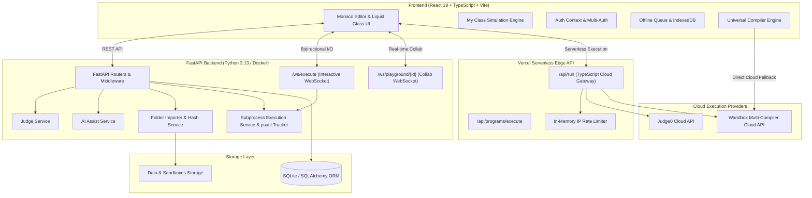
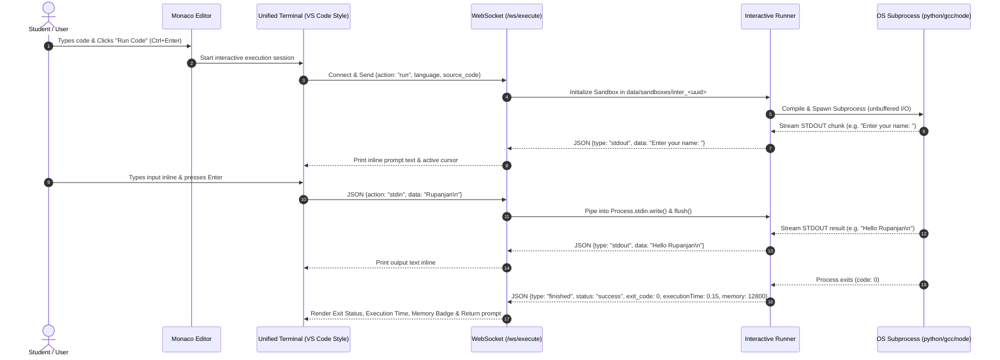
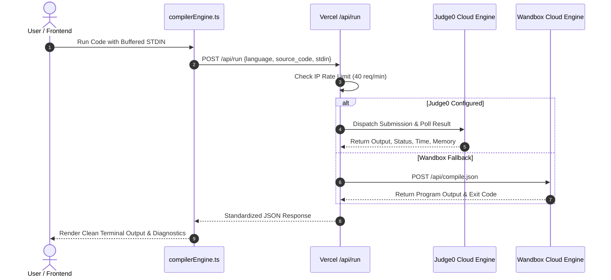
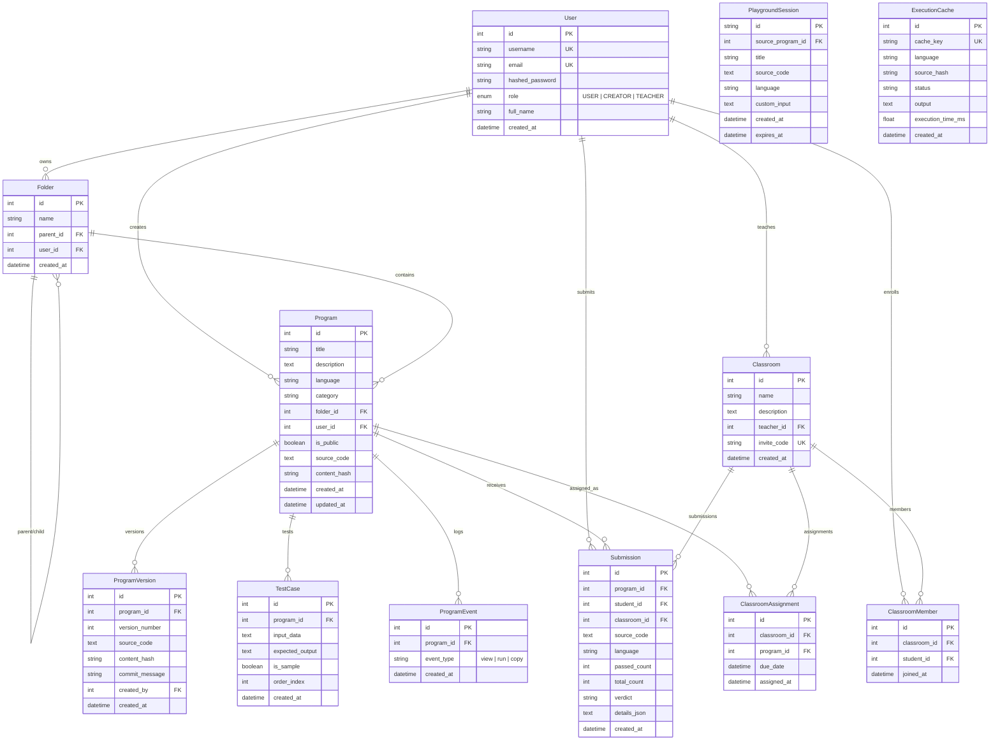
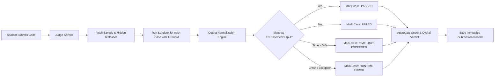

# 🧠 CodeVault Pro — Complete Project Architecture & Technical Documentation ("brain.md")

> **CodeVault Pro** is an enterprise-grade student code library, multi-language compiler sandbox, interactive algorithm learning visualizer, competitive programming judge, and real-time classroom collaboration platform. This document serves as the master technical blueprint and exhaustive documentation of the entire codebase, system architecture, execution mechanics, database models, and APIs.

---

## 📑 Table of Contents

1. [Executive Overview & Vision](#1-executive-overview--vision)
2. [Beginner-Friendly UX Dictionary](#2-beginner-friendly-ux-dictionary)
3. [System Architecture & Data Flow](#3-system-architecture--data-flow)
4. [Directory & Workspace Structure](#4-directory--workspace-structure)
5. [Database Architecture & Schema Design](#5-database-architecture--schema-design)
6. [Multi-Language Execution Engine & Sandboxing](#6-multi-language-execution-engine--sandboxing)
7. [Interactive Algorithm Simulation System ("My Class")](#7-interactive-algorithm-simulation-system-my-class)
8. [Competitive Programming Judge System](#8-competitive-programming-judge-system)
9. [Classrooms & Teacher-Student Workflows](#9-classrooms--teacher-student-workflows)
10. [Real-Time Collaborative Playground (WebSockets)](#10-real-time-collaborative-playground-websockets)
11. [Folder Importer & SHA-256 Deduplication](#11-folder-importer--sha-256-deduplication)
12. [AI Assistant ("Ask for Help") Service](#12-ai-assistant-ask-for-help-service)
13. [Creator Resources Hub & Meet the Team](#13-creator-resources-hub--meet-the-team)
14. [Frontend Architecture & State Management](#14-frontend-architecture--state-management)
15. [Complete REST, Serverless & WebSocket API Reference](#15-complete-rest-serverless--websocket-api-reference)
16. [Security, Roles & Multi-Tenancy](#16-security-roles--multi-tenancy)
17. [Setup, Execution & Deployment Guide](#17-setup-execution--deployment-guide)
18. [Demo Accounts & Test Fixtures](#18-demo-accounts--test-fixtures)

---

## 1. Executive Overview & Vision

CodeVault Pro is engineered to bridge the gap between simple browser code pads, industrial software development environments, and interactive computer science pedagogy. It provides school and university students with a distraction-free, beautifully themed workspace while offering instructors full pedagogical oversight.

### 🌟 Core Capabilities

* **Personal Code Library**: Hierarchical folder structures, category tagging (DSA, Web Dev, Databases, Algorithms, Competitive Programming), full-text search, and quick access.
* **11-Language Compiler Sandbox**: Native subprocesses, Docker containers, Judge0 cloud execution, and Wandbox zero-config fallbacks for C, C++, Python, Java, JavaScript, TypeScript, Go, Rust, Kotlin, HTML/CSS, and SQL.
* **Interactive Terminal & Buffered STDIN**: Unbuffered real-time STDIN/STDOUT streaming via WebSockets and tabbed buffered STDIN for cloud/serverless execution.
* **"My Class" Interactive Algorithm Simulation**: Step-by-step visual execution flow synchronized with live code line highlighting, dynamic variable watch tables, call stack animations, and 7 specialized visualizer canvases.
* **Practice & Check (Competitive Judge)**: Batch testing against sample and hidden test cases with instant verdicts (*Accepted*, *Wrong Answer*, *Time Limit Exceeded*, *Runtime Error*).
* **Classrooms & Assignments**: Dedicated portals for teachers to generate unique invite codes (e.g. `DSA-7F2K`), post problem sets, monitor student progress, and inspect live leaderboards.
* **Real-time Collaborative Playground**: Temporary WebSocket-synchronized coding rooms with peer presence, live code broadcasting, and joint execution.
* **Past Versions & "What Changed"**: Automated immutable revision snapshots with Monaco side-by-side visual diffing.
* **Smart AI Assistant**: Non-destructive code explanations, algorithmic complexity breakdowns, and side-by-side patch suggestions.
* **Bulk Folder & ZIP Importer**: Recursive local directory upload (`webkitdirectory`) with automated language detection and SHA-256 deduplication.
* **Creator Hub & Community**: Curated developer roadmaps, DSA resources, cheat sheets, and direct contact/feedback channels.
* **Offline-First PWA Support**: IndexedDB offline execution queuing and Service Worker asset caching.

---

## 2. Beginner-Friendly UX Dictionary

To ensure junior students are not overwhelmed by heavy DevOps and compiler jargon, CodeVault Pro uses an approachable UI dictionary:

| Traditional Developer Term | CodeVault Pro UI Term | Meaning / Action |
|---|---|---|
| `Execute Binary / Process` | **Run Code** | Compiles and executes code in the secure sandbox |
| `STDOUT / STDERR` | **Output** | Program output and compiler messages |
| `STDIN Stream` | **Input / Buffered STDIN** | Keystrokes/data fed into the running program |
| `Algorithm Tracing / Visualizer` | **My Class** | Interactive step-by-step code & data structure simulator |
| `Competitive Judge` | **Practice & Check** | Batch test runner against multiple test cases |
| `Git Commit History` | **Past Versions** | Saved history of program iterations |
| `Unified / Side-by-Side Diff` | **What Changed** | Visual comparison of code changes |
| `Repository / Root Dir` | **My Code** | Your personal programming library |
| `Tenant / Organization` | **Classroom** | Virtual classroom created by a teacher |

---

## 3. System Architecture & Data Flow

CodeVault Pro follows a decoupled hybrid client-server and serverless cloud topology:



### Execution Flow Sequences

#### A. Interactive WebSocket Terminal (Unbuffered Real-Time I/O)



#### B. Serverless Cloud Execution Flow (`/api/run` & Fallbacks)



---

## 4. Directory & Workspace Structure

```
d:/Personal Project/Online Compiler/
├── api/                            # Vercel Serverless Edge API Handlers
│   ├── execute.ts                  # /api/execute routing proxy
│   ├── health.ts                   # /api/health endpoint
│   ├── index.ts                    # API root entry
│   ├── run.ts                      # /api/run unified cloud execution endpoint
│   └── programs/
│       └── execute.ts              # /api/programs/execute endpoint
│
├── backend/                        # FastAPI Backend Application (Python 3.13)
│   ├── api/                        # REST API Route Handlers
│   │   ├── ai_assist.py            # AI code explanation & fix suggestions
│   │   ├── analytics.py            # Creator view/run/copy analytics
│   │   ├── auth.py                 # Registration, login, JWT token auth
│   │   ├── classrooms.py           # Classrooms, assignments, grading, leaderboards
│   │   ├── execution.py            # Synchronous code execution & process stopping
│   │   ├── import_folder.py        # Folder & ZIP multi-file batch upload
│   │   ├── judge.py                # Practice & Check batch testcase runner
│   │   ├── playground.py           # Collaborative session management
│   │   ├── programs.py             # Program CRUD, categories, search, folders
│   │   └── versions.py             # Version history snapshots & Monaco diffing
│   ├── database/                   # Database Connection & Seed Data
│   │   ├── database.py             # SQLAlchemy engine & session factory
│   │   └── seed.py                 # Pre-loaded demo users, programs, & classrooms
│   ├── executor/                   # Sandboxed Subprocess Execution Engine
│   │   ├── execution_service.py    # Synchronous runner with caching
│   │   ├── interactive_runner.py   # Asynchronous bidirectional WebSocket runner
│   │   ├── registry.py             # Language runner registry & alias mapper
│   │   ├── runner_interface.py     # BaseRunner abstract interface
│   │   ├── subprocess_runner.py    # Process isolation & timeout enforcement
│   │   └── runners/                # 11 Language-Specific Subprocess Implementations
│   │       ├── c/                  # GCC compiler runner
│   │       ├── cpp/                # G++ (C++17) compiler runner
│   │       ├── go/                 # Go runtime runner
│   │       ├── html/               # HTML preview generator
│   │       ├── java/               # OpenJDK (javac + java) runner
│   │       ├── javascript/         # Node.js runner
│   │       ├── kotlin/             # Kotlinc / Java runner
│   │       ├── python/             # Python 3.13 unbuffered runner
│   │       ├── rust/               # Rustc runner
│   │       ├── sql/                # In-memory SQLite runner
│   │       └── typescript/         # Node.js with stripped types runner
│   ├── models/                     # SQLAlchemy ORM Models
│   │   └── __init__.py             # Complete schema (Users, Programs, Submissions, etc.)
│   ├── schemas/                    # Pydantic v2 Validation Schemas
│   │   └── __init__.py             # Request & Response DTOs
│   ├── services/                   # Business Logic Services
│   │   ├── ai_service.py           # Gemini/OpenAI/Fallback AI engine
│   │   ├── analytics_service.py    # Event tracking & 30-day metrics
│   │   ├── diff_service.py         # Unified diff generator
│   │   ├── hash_service.py         # SHA-256 content hashing
│   │   ├── importer.py             # Directory walker & folder hierarchy builder
│   │   └── judge_service.py        # Testcase normalization & grading
│   ├── tests/                      # Automated Test Suite
│   │   └── test_api.py             # Pytest tests for API, execution, auth
│   ├── utils/                      # Security & Helper Utilities
│   │   └── security.py             # Password hashing & JWT token validation
│   ├── websockets/                 # WebSocket Route Handlers
│   │   ├── execution_ws.py         # Real-time interactive terminal socket
│   │   └── playground_ws.py        # Collaborative code room socket
│   ├── config.py                   # Environment variables & constants
│   └── main.py                     # FastAPI entry point & lifespan events
│
├── frontend/                       # React 19 + TypeScript + Vite Frontend
│   ├── public/                     # Static assets, team photos & PWA manifest
│   ├── src/
│   │   ├── assets/                 # Icons, badges, and brand assets
│   │   ├── components/             # Reusable UI Components
│   │   │   ├── AIAssistPanel.tsx   # AI Assistant drawer & diff applicator
│   │   │   ├── AnalyticsModal.tsx  # Recharts 30-day views/runs trend graph
│   │   │   ├── CodeEditor.tsx      # Monaco Editor wrapper with theme sync
│   │   │   ├── DiffViewer.tsx      # Monaco Side-by-Side Diff Viewer
│   │   │   ├── Navbar.tsx          # Navigation, theme toggle, user badge
│   │   │   ├── OutputTerminal.tsx  # Multi-mode terminal & STDIN manager
│   │   │   ├── PracticeJudge.tsx   # Testcase runner, sample/hidden view
│   │   │   └── VersionHistory.tsx  # Version list, commit history & restore
│   │   ├── context/                # React Context Providers
│   │   │   ├── AuthContext.tsx     # JWT + Firebase multi-auth provider
│   │   │   ├── OfflineContext.tsx  # Offline sync & queue provider
│   │   │   └── ThemeContext.tsx    # Dark/Light theme switching
│   │   ├── learning/               # "My Class" Interactive Algorithm Simulation System
│   │   │   ├── components/         # Simulation Player & Inspection UI Panels
│   │   │   │   ├── CodeViewerPanel.tsx     # Synchronized code line viewer
│   │   │   │   ├── OutputViewerPanel.tsx   # Accumulated output stream viewer
│   │   │   │   ├── PlaybackControlBar.tsx  # Play/Pause/Step/Speed controller
│   │   │   │   ├── PresetSelector.tsx      # Input preset dropdown & custom input
│   │   │   │   ├── ProgramCard.tsx         # Algorithm lesson catalog card
│   │   │   │   ├── StepExplanationPanel.tsx# Plain-English step explanation
│   │   │   │   └── VariableWatchPanel.tsx  # Live variable state inspector
│   │   │   ├── core/
│   │   │   │   └── types.ts        # Lesson, Step, Variable, Pacing TypeScript types
│   │   │   ├── programs/           # 14 Interactive Algorithm Lessons
│   │   │   │   ├── arrays/         # Array Reverse (Two Pointers)
│   │   │   │   ├── graphs/         # BFS & DFS Graph Traversals
│   │   │   │   ├── linkedList/     # Middle Node & Reverse Linked List
│   │   │   │   ├── recursion/      # Factorial & Fibonacci Sequence
│   │   │   │   ├── searching/      # Binary Search & Linear Search
│   │   │   │   ├── sorting/        # Bubble, Insertion, & Selection Sort
│   │   │   │   ├── stackQueue/     # Stack (Push/Pop) & Queue (Enqueue/Dequeue)
│   │   │   │   └── trees/          # Binary Tree Traversals (Inorder/Pre/Post)
│   │   │   ├── registry/
│   │   │   │   └── learningPrograms.ts     # Master program registry & search index
│   │   │   └── renderers/          # 7 Custom Data Structure Visualizer Canvases
│   │   │       ├── ArrayVisualizer.tsx     # Bar charts & pointer indicators
│   │   │       ├── GraphVisualizer.tsx     # Network graph SVG layout & BFS/DFS state
│   │   │       ├── LinkedListVisualizer.tsx# Linked list nodes & pointer arrows
│   │   │       ├── QueueVisualizer.tsx     # Horizontal FIFO queue visualizer
│   │   │       ├── RecursionVisualizer.tsx # Call stack frames & recursion tree
│   │   │       ├── StackVisualizer.tsx     # Vertical LIFO stack container
│   │   │       └── TreeVisualizer.tsx      # Binary tree SVG hierarchy & traversal
│   │   ├── pages/                  # Page-Level Views (15 Routes)
│   │   │   ├── AboutPage.tsx       # Documentation, architecture, shortcuts
│   │   │   ├── ClassroomDetailPage.tsx # Teacher management & student submission
│   │   │   ├── ClassroomListPage.tsx   # Classroom directory & join modal
│   │   │   ├── ContactPage.tsx     # Team cards, contact info & feedback form
│   │   │   ├── CreateProgramPage.tsx   # Program wizard with templates
│   │   │   ├── CreatorPage.tsx     # Creator profile, DSA roadmaps & resource downloads
│   │   │   ├── HomePage.tsx        # Hero, quick compiler, feature tour
│   │   │   ├── ImportPage.tsx      # Folder / ZIP upload & sync
│   │   │   ├── InteractiveClassPage.tsx# Step-by-step algorithm IDE & visualizer
│   │   │   ├── LoginPage.tsx       # Tabbed Login, Register & Phone OTP
│   │   │   ├── MyClassPage.tsx     # Interactive algorithm lesson catalog
│   │   │   ├── MyProgramsPage.tsx  # Personal file tree & code manager
│   │   │   ├── PlaygroundPage.tsx  # Collaborative real-time coding room
│   │   │   ├── ProgramDetailPage.tsx   # Main IDE (Editor, Terminal, Judge, AI)
│   │   │   └── ProgramsPage.tsx    # Public code directory & search
│   │   ├── services/               # Frontend API & Helper Services
│   │   │   ├── api.ts              # Axios HTTP client with JWT interceptor
│   │   │   ├── compilerEngine.ts   # Universal execution (Cloud + Client + Local)
│   │   │   ├── defaultPrograms.ts  # Seed templates for 11 languages
│   │   │   └── firebase.ts         # Firebase Auth SDK initialization
│   │   ├── App.tsx                 # Route declarations & main shell
│   │   ├── index.css               # Tailwind directives & custom CSS
│   │   └── main.tsx                # React DOM root entry
│   ├── package.json                # Frontend dependencies
│   ├── tailwind.config.js          # Tailwind CSS design system configuration
│   └── vite.config.ts              # Vite bundler configuration
│
├── server/                         # Unified TypeScript Cloud Compiler Service
│   ├── compilerService.ts          # Judge0 & Wandbox cloud execution engine
│   └── index.ts                    # Standalone Node.js execution server
│
├── data/                           # Runtime Storage Directory (Auto-created)
│   ├── codevault.db                # SQLite database file
│   ├── execution_cache/            # Cached binary execution outputs
│   └── sandboxes/                  # Temporary isolated execution directories
├── Dockerfile                      # Full multi-compiler Linux container image
├── render.yaml                     # Render.com Blueprint deployment spec
├── requirements.txt                # Python backend dependencies
├── package.json                    # Workspace root package scripts
└── vercel.json                     # Vercel edge deployment configuration
```

---

## 5. Database Architecture & Schema Design

CodeVault Pro uses SQLAlchemy with SQLite (and supports PostgreSQL via `DATABASE_URL`). The schema enforces relational integrity, cascading deletes, and strict tenant separation.

### Entity Relationship Diagram



---

## 6. Multi-Language Execution Engine & Sandboxing

CodeVault Pro implements a robust multi-tiered execution pipeline tailored for both high-concurrency cloud deployments and zero-friction student interaction:

### Execution Tiers

1. **Tier 1: Native Subprocess Runner with Real Metrics** (`backend/executor/subprocess_runner.py`):
   * Backed by `POST /api/execute` and `POST /api/programs/execute`.
   * Real peak RSS memory measurement via background thread sampling with `psutil` every 10ms.
   * Hard limits: Wall-clock timeout (5.0s), Memory Limit (256 MB), and Output buffer limit (1 MB).
   * Active Process Tracker (`active_process_tracker`) allows stopping any running execution PID and its entire child process tree on demand via `POST /api/execute/stop`.

2. **Tier 2: Interactive Asynchronous Streaming Runner** (`backend/executor/interactive_runner.py`):
   * Backed by FastAPI WebSockets (`/ws/execute`).
   * Spawns unbuffered OS subprocesses in temporary sandbox directories (`data/sandboxes/inter_<uuid>`).
   * Reads standard output and error asynchronously in real-time chunks (1024 bytes).
   * Accepts user keystrokes piped directly to `process.stdin` on demand.

3. **Tier 3: Cloud Compiler Gateway (`/api/run` & `server/compilerService.ts`)**:
   * Enables 100% serverless cloud compilation on Vercel or cloud containers without local compilers.
   * Dispatches to **Judge0 Cloud Engine** or **Wandbox API** zero-config fallback.
   * Built-in IP rate limiter (40 req/min per IP) and JSON payload sanitization.

4. **Tier 4: In-Browser Client Sandbox (`compilerEngine.ts`)**:
   * Evaluates JavaScript and TypeScript client-side when completely offline using isolated function scopes, STDIN simulation, and intercepted `console.log`.

5. **Tier 5: HTML Live Preview**:
   * Sandboxed iframe rendering for instant live DOM updates.

### 11 Supported Languages & Compiler Matrix

| Language | Identifier | Compiler / Interpreter | Standard Flags & Invocation | Cloud Compiler Target |
|---|---|---|---|---|
| **Python** | `python`, `py` | CPython 3.13 | `python -u solution.py` (`PYTHONUNBUFFERED=1`) | `cpython-3.13.8` |
| **C** | `c` | GCC 13+ | `gcc -O2 main.c -o main.exe && ./main.exe` | `gcc-13.2.0-c` |
| **C++** | `cpp`, `c++` | G++ 13+ | `g++ -std=c++17 -O2 main.cpp -o main.exe && ./main.exe` | `gcc-13.2.0` |
| **Java** | `java` | OpenJDK 22 | Auto-extracts class $\to$ `javac Main.java && java Main` | `openjdk-jdk-22+36` |
| **JavaScript** | `javascript`, `js` | Node.js 20+ | `node index.js` | `nodejs-20.17.0` |
| **TypeScript** | `typescript`, `ts` | Node.js 20+ / TS 5.6 | `node --experimental-strip-types index.ts` | `typescript-5.6.2` |
| **Go** | `go` | Golang 1.23+ | `go run main.go` | `go-1.23.2` |
| **Rust** | `rust`, `rs` | Rustc 1.82+ | `rustc -O main.rs -o main.exe && ./main.exe` | `rust-1.82.0` |
| **Kotlin** | `kotlin`, `kt` | Kotlinc + JVM 22 | `kotlinc Solution.kt -include-runtime -d app.jar && java -jar app.jar` | `openjdk-jdk-22+36` |
| **SQL** | `sql`, `sqlite` | SQLite 3 / Python | In-memory SQLite runner with dynamic table formatting | `cpython-3.13.8` / SQLite |
| **HTML / CSS** | `html` | Browser Sandbox | In-browser iframe rendering with instant DOM preview | Client DOM Preview |

### Error Classification & Diagnostics Engine

The execution subsystem automatically parses compiler and interpreter diagnostics into unified error categories:

| Error Category | Detected Signatures / Causes | Visual UI State |
|---|---|---|
| `SyntaxError` / `IndentationError` | `SyntaxError:`, `IndentationError:`, invalid token | Red cross, formatted traceback, code line indicator |
| `ZeroDivisionError` | `ZeroDivisionError: division by zero` | Red cross, runtime error banner |
| `NameError` / `TypeError` / `ValueError` | `NameError:`, `TypeError:`, `ValueError:` | Red cross, runtime error banner |
| `CompilationError` | GCC/G++ `error:`, `javac` compilation failure | Red cross, compiler diagnostic log |
| `TimeLimitExceeded` (TLE) | Process elapsed time > 5.0 seconds | Amber clock, "⏱ Time Limit Exceeded" banner |
| `MemoryLimitExceeded` (MLE) | Peak RSS memory > 256 MB | Purple lightning, "⚡ Memory Limit Exceeded" banner |
| `OutputLimitExceeded` (OLE) | Output buffer > 1 MB | Warning note with auto-truncation |
| `UserCancelled` | User clicked Stop (Ctrl+Shift+K) | Grey warning, `^C [Process terminated by user]` |

---

## 7. Interactive Algorithm Simulation System ("My Class")

The **"My Class"** sub-system (`/my-class` and `/my-class/:slug`) transforms abstract data structures and algorithmic complexity into interactive, step-by-step visual simulations.

```
┌────────────────────────────────────────────────────────────────────────┐
│                        My Class Architecture                           │
├──────────────────────────┬─────────────────────────────────────────────┤
│   Left Panel             │   Right Panel                               │
│   ┌────────────────────┐ │   ┌───────────────────────────────────────┐ │
│   │ Multi-Language Code│ │   │ Specialized Canvas Visualizer         │ │
│   │ Viewer with Live   │ │   │ (Array / List / Stack / Tree / Graph) │ │
│   │ Line Highlighting  │ │   └───────────────────────────────────────┘ │
│   │ (C++, Python, Java)│ │   ┌───────────────────────────────────────┐ │
│   └────────────────────┘ │   │ Live Variable Watch Table             │ │
│   ┌────────────────────┐ │   └───────────────────────────────────────┘ │
│   │ Accumulated STDOUT │ │   ┌───────────────────────────────────────┐ │
│   │ Terminal Output    │ │   │ Step Explanation & Algorithm Insight  │ │
│   └────────────────────┘ │   └───────────────────────────────────────┘ │
├──────────────────────────┴─────────────────────────────────────────────┤
│   Bottom: Dynamic Playback Bar (Play, Pause, Step +/-, Speed: Slow 2.8s)│
└────────────────────────────────────────────────────────────────────────┘
```

### Core Architecture Components

1. **Deterministic Trace Generator (`generateTrace`)**:
   * Evaluates input data and yields an immutable sequence of `LearningStep` frames.
   * Each step records: active line number, visualizer data state, variable snapshot table, step description, event type, and stdout diff.

2. **Synchronized Code Line Highlighter (`CodeViewerPanel`)**:
   * Displays full source code implementations in C++, Python, Java, or JavaScript.
   * Highlights the exact executing code line in real-time as the simulation advances.

3. **7 Specialized Visualizer Canvases**:
   * **`ArrayVisualizer`**: Bar height representations, active pointer tags (`i`, `j`, `mid`, `key`), comparing/swapping/sorted color coding.
   * **`LinkedListVisualizer`**: Node cards with data fields and pointer arrows, `head`, `prev`, `curr`, `next`, `slow`, `fast` indicators.
   * **`StackVisualizer`**: Vertical LIFO cylinder container with animated push/pop badges and `TOP` indicator.
   * **`QueueVisualizer`**: Horizontal FIFO queue container with `FRONT` and `REAR` pointer badges.
   * **`TreeVisualizer`**: Hierarchical SVG binary tree diagram, highlighted traversal paths (Inorder/Preorder/Postorder), visited node glow.
   * **`GraphVisualizer`**: SVG node-and-edge layout with real-time BFS queue / DFS stack state, visited set, and edge highlight animations.
   * **`RecursionVisualizer`**: Visual call stack frames with argument inspection, base case trigger badges, and return value bubble-up.

4. **Dynamic Pacing Engine & Playback Controls**:
   * **Speed Modes**: Slow (2.8s dynamic delay), Normal (1.2s), Fast (0.5s), Ultra (0.2s).
   * **Event-Aware Dynamic Delay**: Automatically extends pauses on critical algorithm moments (swaps, base case returns, key findings) to maximize learner comprehension.
   * **Controls**: Full scrubber bar, Step Forward, Step Backward, Play/Pause, Reset, and Preset Selector.

### 14 Built-In Interactive Lessons Across 8 Categories

| Category | Slug | Title | Key Concepts & Visual Highlights |
|---|---|---|---|
| **Sorting** | `bubble-sort` | Bubble Sort | Adjacent comparisons, bubble up maximum, swap animations, early termination optimization |
| **Sorting** | `selection-sort` | Selection Sort | Finding minimum element in unsorted subarray, swapping to sorted prefix |
| **Sorting** | `insertion-sort` | Insertion Sort | Shifting larger elements right, inserting key into correct position |
| **Searching** | `binary-search` | Binary Search | Divide & conquer, `low`, `high`, `mid` pointer recalculation, search space halving |
| **Searching** | `linear-search` | Linear Search | Sequential index traversal, target match detection |
| **Linked List** | `reverse-linked-list` | Reverse Linked List | Three-pointer technique (`prev`, `curr`, `next`), pointer redirection |
| **Linked List** | `middle-linked-list` | Middle of Linked List | Tortoise and Hare algorithm (Slow & Fast pointers) |
| **Stack & Queue** | `stack-push-pop` | Stack Operations | LIFO mechanics, Top pointer increment/decrement, Overflow/Underflow checks |
| **Stack & Queue** | `queue-enqueue-dequeue`| Queue Operations | FIFO mechanics, Front and Rear pointer adjustments |
| **Trees** | `tree-traversals` | Binary Tree Traversals | Recursive Inorder ($L \to N \to R$), Preorder ($N \to L \to R$), and Postorder ($L \to R \to N$) |
| **Graphs** | `bfs-traversal` | Breadth-First Search | Queue-based level-order exploration, visited array tracking |
| **Graphs** | `dfs-traversal` | Depth-First Search | Stack/recursive graph traversal, backtracking path exploration |
| **Recursion** | `factorial-recursion` | Factorial Calculation | Call stack creation, parameter passing, base case ($n \le 1$), return propagation |
| **Recursion** | `fibonacci-recursion` | Fibonacci Sequence | Recursion tree branching, overlapping subproblems |
| **Arrays** | `array-reverse` | Array Reverse | Two-pointer technique (`left`, `right`), in-place swapping |

---

## 8. Competitive Programming Judge System

The Practice & Check system allows students to solve algorithmic challenges and verify their solutions against multiple test cases.

### Testcase Workflow



### Output Normalization Algorithm

To prevent unfair failures due to OS newline discrepancies (`\r\n` vs `\n`) or trailing space artifacts:
```python
def normalize_output(text: str) -> str:
    if not text:
        return ""
    lines = [line.rstrip() for line in text.replace("\r\n", "\n").replace("\r", "\n").split("\n")]
    while lines and not lines[-1]:
        lines.pop()
    return "\n".join(lines)
```

### Privacy Guarantee
* **Sample Test Cases**: Full input, expected output, and actual output are rendered to the student.
* **Hidden Test Cases**: Input and expected output are masked as `[Hidden Test Case]`. If failed, actual output is masked as `[Output Hidden]`.

---

## 9. Classrooms & Teacher-Student Workflows

CodeVault Pro features a dedicated role-isolated classroom sub-system.

### Key Roles
* `TEACHER`: Can create classrooms, generate random formatted invite codes (`DSA-7F2K`), assign coding problems with test cases, view student submissions, and inspect live leaderboards.
* `USER` (Student): Can join classrooms using invite codes, solve assigned problems in the built-in IDE, submit for automated grading, and view their individual scorecard.

### Leaderboard Computation
The classroom leaderboard dynamically aggregates:
$$\text{Rank Score} = \text{Passed Testcases Count} \times 100 - \text{Total Attempts} \times 2$$

Teachers can instantly filter by assignment and inspect the student's exact submitted source code and per-testcase execution logs.

---

## 10. Real-Time Collaborative Playground (WebSockets)

The Collaborative Playground enables peer-to-peer coding sessions in temporary WebSocket rooms (`/ws/playground/{room_id}`).

### Broadcast Protocol & Message Types

| Message Type | Direction | Payload Structure | Purpose |
|---|---|---|---|
| `init` | Server $\to$ Client | `{type, code, language, peers: [{id, name, color}]}` | Sends current room state upon joining |
| `user_joined` | Server $\to$ Client | `{type, user: {id, name, color}}` | Alerts peers of a new collaborator |
| `code_change` | Bidirectional | `{type, code, senderId}` | Broadcasts live Monaco editor text changes |
| `language_change` | Bidirectional | `{type, language, senderId}` | Switches room compiler language |
| `cursor` | Bidirectional | `{type, senderId, cursor: {lineNumber, column}}` | Tracks peer cursor positions |
| `run_code` | Client $\to$ Server | `{type, custom_input}` | Initiates joint execution |
| `run_started` | Server $\to$ Client | `{type, senderName}` | Broadcasts compilation start badge |
| `run_finished` | Server $\to$ Client | `{type, status, output, error, execution_time_ms}` | Broadcasts output to all connected peers |
| `user_left` | Server $\to$ Client | `{type, clientId}` | Cleans up peer cursor upon disconnect |

---

## 11. Folder Importer & SHA-256 Deduplication

The folder importer (`backend/services/importer.py`) enables students and teachers to drag-and-drop entire project folders or `.zip` files into CodeVault Pro:

1. **Recursive Traversal**: Uses HTML5 `webkitdirectory` or Python `zipfile` extraction to read folder trees.
2. **Ignore Filters**: Automatically ignores non-code bloat:
   * Directories: `.git`, `node_modules`, `__pycache__`, `venv`, `dist`, `build`, `.vscode`.
   * Files: `.exe`, `.dll`, `.class`, `.pyc`, `.o`, `.zip`, `.tar.gz`.
3. **Category Auto-Inference**: Uses heuristics based on root folder names:
   * Folder names containing `dsa`, `tree`, `graph`, `dp` $\to$ **Data Structures & Algorithms**
   * Folder names containing `web`, `html`, `css`, `js` $\to$ **Web Development**
   * Folder names containing `contest`, `leetcode`, `cp` $\to$ **Competitive Programming**
   * Folder names containing `sql`, `db` $\to$ **Database & SQL**
4. **SHA-256 Deduplication**: Generates a content hash for every file. If a file with the same hash exists, it skips duplicate writes or logs a revision version.

---

## 12. AI Assistant ("Ask for Help") Service

The AI Assistant is an opt-in, student-centric tutoring engine (`backend/services/ai_service.py`):

### Features
1. **Explain Code**: Breaks down program flow, line-by-line logic, algorithmic time complexity ($O(N)$), space complexity, and provides a beginner tip.
2. **Suggest Fix**: Accepts failing testcase information, error logs, and source code to generate an actionable patch.

### Architecture & Fallback Tier
* **Tier 1 (Google Gemini)**: Calls `gemini-1.5-flash` API if `GEMINI_API_KEY` is configured.
* **Tier 2 (OpenAI)**: Calls `gpt-4o-mini` API if `OPENAI_API_KEY` is configured.
* **Tier 3 (Intelligent Built-in Engine)**: Deterministic heuristic static analysis engine that extracts symbols, line counts, and provides syntax-specific advice without external API keys.

### Non-Destructive Diff Applicator
AI fix suggestions are returned as unified diffs and displayed in the Monaco Diff Viewer. AI suggestions **never** overwrite user code without the user explicitly clicking **"Apply Fix"**.

---

## 13. Creator Resources Hub & Meet the Team

CodeVault Pro provides dedicated community portals for students, developers, and educators:

### Creator & Resources Hub (`/creator`)
* **Developer Showcase**: Profile of creator Rupanjan Dutta with portfolio, social links, and project vision.
* **Curated Learning Roadmaps**: Python Mastery, C/C++ Data Structures, Web Development, and Database & SQL.
* **Resource Downloads**: Direct links to curated GitHub repositories, Mega project archives, cheat sheets, and starter kits.

### Meet the Team & Contact (`/contact`)
* **Team Cards**: Glassmorphism cards featuring core contributors (Rupanjan Dutta - Core Engineer, Souvik Saha - UI/UX & Co-Developer) with role badges, GitHub/portfolio links, and skill tags.
* **Direct Feedback System**: Interactive feedback and contact form with client-side validation, submission simulation, and toast notifications.

---

## 14. Frontend Architecture & State Management

Built with **React 19**, **TypeScript**, and **Tailwind CSS**, the frontend uses an ergonomic component hierarchy and Liquid Glass design tokens:

### Context Providers
* `AuthContext` ([AuthContext.tsx](file:///d:/Personal%20Project/Online%20Compiler/frontend/src/context/AuthContext.tsx)): Handles JWT token storage, profile synchronization, Firebase authentication (Google, GitHub, Phone OTP), and automatic demo account fallbacks.
* `OfflineContext` ([OfflineContext.tsx](file:///d:/Personal%20Project/Online%20Compiler/frontend/src/context/OfflineContext.tsx)): Monitors browser `navigator.onLine` events, stores offline runs in IndexedDB, and auto-syncs when reconnected.
* `ThemeContext` ([ThemeContext.tsx](file:///d:/Personal%20Project/Online%20Compiler/frontend/src/context/ThemeContext.tsx)): Manages modern dark/light UI modes and synchronizes Monaco editor themes (`vs-dark` vs `vs`).

### Core Page Routes (15 Routes)

| Route | Page Component | Key Functionality |
|---|---|---|
| `/` | `HomePage` | Hero section, live quick compiler, feature grid, global statistics |
| `/programs` | `ProgramsPage` | Public program library, search bar, language filters, card grid |
| `/programs/:id` | `ProgramDetailPage` | Full IDE (Monaco Editor, Interactive Terminal, Judge, Versions, AI) |
| `/my-programs` | `MyProgramsPage` | Personal folder tree manager, program creator, folder organizer |
| `/create` | `CreateProgramPage` | Program creation wizard with templates and initial test cases |
| `/import` | `ImportPage` | Folder drag-and-drop & ZIP file batch importer |
| `/my-class` | `MyClassPage` | Interactive algorithm classroom catalog & concept search |
| `/my-class/:slug` | `InteractiveClassPage` | Step-by-step visual algorithm IDE, synchronized code trace & visualizers |
| `/playground` | `PlaygroundPage` | Collaborative room generator & multi-user WebSocket IDE |
| `/playground/:roomId` | `PlaygroundPage` | Connected collaborative coding session |
| `/classrooms` | `ClassroomListPage` | Classroom browser, join modal, teacher classroom creator |
| `/classrooms/:id` | `ClassroomDetailPage` | Teacher assignment publisher, student submissions, leaderboard |
| `/creator` | `CreatorPage` | Creator bio, curated DSA roadmaps, cheat sheets & resource archives |
| `/contact` | `ContactPage` | Team profile cards, direct communication channels & feedback form |
| `/login` | `LoginPage` | Email/password, demo one-click logins, Google/GitHub/Phone auth |
| `/about` | `AboutPage` | Architecture overview, UX dictionary, shortcut guide |

---

## 15. Complete REST, Serverless & WebSocket API Reference

### 🔐 Authentication (`/api/auth`)

| Method | Endpoint | Request Body | Description |
|---|---|---|---|
| `POST` | `/api/auth/register` | `{username, email, password, role, full_name}` | Create a new user account |
| `POST` | `/api/auth/login` | `{username_or_email, password}` | Authenticate and receive JWT token |
| `GET` | `/api/auth/me` | *Bearer Token* | Get current authenticated user profile |

### 📂 Programs & Versions (`/api/programs`)

| Method | Endpoint | Description |
|---|---|---|
| `GET` | `/api/programs` | List public programs with search & category filters |
| `POST` | `/api/programs` | Create a new program with optional test cases |
| `GET` | `/api/programs/mine` | List all programs and folders belonging to current user |
| `GET` | `/api/programs/{id}` | Get full program details, versions, and test cases |
| `PUT` | `/api/programs/{id}` | Update program code (automatically creates a new version) |
| `DELETE` | `/api/programs/{id}` | Delete program (owner only) |
| `POST` | `/api/programs/folders` | Create a new folder |
| `GET` | `/api/programs/{id}/versions` | List all version snapshots for a program |
| `GET` | `/api/programs/{id}/versions/{v_id}` | Get specific version snapshot |
| `GET` | `/api/programs/{id}/diff` | Compare two versions and return unified diff |

### ⚡ Execution & Judge Endpoints

| Method | Endpoint | Request Body | Description |
|---|---|---|---|
| `POST` | `/api/run` | `{language, code, stdin, execution_id}` | Unified Vercel serverless cloud execution gateway (Judge0 + Wandbox) |
| `POST` | `/api/execute` | `{language, code, stdin, execution_id}` | Standard synchronous execution with memory, time, error classification |
| `POST` | `/api/execute/stop` | `{execution_id}` | Immediately terminates active running process PID tree |
| `POST` | `/api/programs/execute` | `{language, source_code, custom_input, program_id}` | Legacy compatible execution endpoint |
| `GET` | `/api/health` | None | Server health status check |
| `POST` | `/api/judge/run-checks` | `{program_id, source_code, language}` | Evaluate solution against all test cases |
| `GET` | `/api/judge/submissions/{program_id}` | *Bearer Token* | Retrieve student submission history |
| `WS` | `/ws/execute` | Bidirectional JSON & Text | Real-time unbuffered interactive terminal with live STDIN |

#### Standard Execution JSON Contract

**Request Schema**:
```json
{
  "language": "python",
  "code": "name = input()\nprint(f'Hello {name}')",
  "stdin": "Rupanjan"
}
```

**Success Response (HTTP 200)**:
```json
{
  "success": true,
  "status": "success",
  "stdout": "Hello Rupanjan\n",
  "stderr": "",
  "output": "Hello Rupanjan\n",
  "executionTime": 0.16,
  "execution_time_ms": 156.98,
  "memory": 12800,
  "exitCode": 0,
  "exit_code": 0,
  "stage": "runtime",
  "cached": false
}
```

**Error Response (HTTP 200)**:
```json
{
  "success": false,
  "status": "error",
  "stdout": "",
  "stderr": "ZeroDivisionError: division by zero",
  "output": "",
  "error": "ZeroDivisionError: division by zero",
  "executionTime": 0.01,
  "execution_time_ms": 12.4,
  "memory": 8200,
  "exitCode": 1,
  "exit_code": 1,
  "error_type": "ZeroDivisionError",
  "stage": "runtime",
  "cached": false
}
```

### 🏫 Classrooms (`/api/classrooms`)

| Method | Endpoint | Request Body | Description |
|---|---|---|---|
| `POST` | `/api/classrooms` | `{name, description}` | Create a new classroom (Teacher only) |
| `GET` | `/api/classrooms` | *Bearer Token* | List classrooms (taught or enrolled) |
| `GET` | `/api/classrooms/{id}` | *Bearer Token* | Get classroom details and member roster |
| `POST` | `/api/classrooms/join` | `{invite_code}` | Join classroom as a student |
| `POST` | `/api/classrooms/{id}/assign` | `{program_id, due_date}` | Assign coding problem to classroom |
| `GET` | `/api/classrooms/{id}/assignments`| *Bearer Token* | List all assignments and completion status |
| `GET` | `/api/classrooms/{id}/leaderboard`| *Bearer Token* | Get real-time scored student leaderboard |

### 🤖 AI Assistant & Analytics (`/api/ai` & `/api/analytics`)

| Method | Endpoint | Request Body | Description |
|---|---|---|---|
| `POST` | `/api/ai/explain` | `{source_code, language, context}` | Generates algorithmic code explanation |
| `POST` | `/api/ai/suggest-fix`| `{source_code, language, error_message, ...}` | Generates fix and unified diff |
| `GET` | `/api/analytics/program/{id}` | *Bearer Token* | 30-day views, runs, copies analytics |
| `POST` | `/api/analytics/event` | `{program_id, event_type}` | Log program interaction event |

---

## 16. Security, Roles & Multi-Tenancy

CodeVault Pro implements defensive security best practices across every tier:

* **Authentication**: Password hashing using `passlib` with Argon2/bcrypt algorithms. Stateless JSON Web Tokens (JWT) signed with HMAC-SHA256.
* **Role-Based Access Control (RBAC)**:
  * Strict dependency guards (`require_teacher`, `get_current_user`).
  * Students cannot view assignments of classrooms they are not enrolled in.
  * Submissions are strictly private between student and classroom teacher.
* **Sandbox Defense**:
  * Child subprocesses run with strict timeouts (5.0s default) to prevent infinite loops (`while(true)`).
  * Output buffer truncated at 1 MB to prevent memory overflow attacks.
  * Peak memory caps enforced at 256 MB.
  * Ephemeral execution directories automatically cleaned up upon process termination.
* **Serverless Edge Rate Limiting**:
  * In-memory token bucket rate limiting (40 requests per minute per IP) to prevent denial-of-service and API abuse.

---

## 17. Setup, Execution & Deployment Guide

### Prerequisites
* **Python**: Python 3.10+ (Recommended: Python 3.13)
* **Node.js**: Node.js 18+ (Recommended: Node.js 20+)
* **C/C++/Java/Go Compilers** (Optional for local execution; cloud fallback handles execution when local compilers are omitted).

### 1. Local Backend Setup

```powershell
# Navigate to project root
cd "d:\Personal Project\Online Compiler"

# Activate Python virtual environment
.\venv\Scripts\Activate.ps1

# Install backend dependencies
pip install -r requirements.txt

# Start FastAPI server on port 8000
python -m uvicorn backend.main:app --host 127.0.0.1 --port 8000 --reload
```

### 2. Local Frontend Setup

```powershell
# Open a new terminal and navigate to frontend directory
cd "d:\Personal Project\Online Compiler\frontend"

# Install node dependencies
npm install

# Start Vite dev server on port 5173
npm run dev
```

Visit **`http://localhost:5173`** in your browser.

### 3. Production Deployment Architecture (Render + Vercel)

For true, real-time interactive terminal execution with persistent WebSockets (`/ws/execute`), genuine OS subprocesses (`subprocess.Popen`), and memory profiling, deploy using the industry standard decoupled topology:

```
┌──────────────────────────────────────────────────────────┐
│                   Vercel (Frontend)                      │
│             React 19 + Vite SPA (Edge CDN)               │
│                                                          │
│  Environment Variables in Vercel Dashboard:              │
│    VITE_API_URL = https://codevault-backend.onrender.com │
│    VITE_WS_URL  = wss://codevault-backend.onrender.com   │
└────────────┬─────────────────────────────┬───────────────┘
             │ REST APIs                   │ Persistent WebSockets
             │ (/api/execute, auth, etc.)  │ (/ws/execute, /ws/playground)
             ▼                             ▼
┌──────────────────────────────────────────────────────────┐
│                 Render.com (Backend API)                 │
│         FastAPI + Uvicorn (Linux Docker Runner)          │
│                                                          │
│  - Python 3.11, GCC 13, G++, OpenJDK 21, Node.js, SQLite │
│  - Real-time Bidirectional WebSocket I/O                 │
│  - Peak Resident Set (psutil) Memory Profiling           │
└──────────────────────────────────────────────────────────┘
```

#### Step A: Deploy Backend on Render.com
1. Go to [https://render.com](https://render.com) and create a **New Web Service**.
2. Connect your GitHub repository: `https://github.com/RupanjanDutta2006/Code`.
3. Choose **Docker** as the runtime (or use the included `render.yaml` Blueprint).
   * **Root Directory**: `.`
   * **Dockerfile Path**: `./Dockerfile`
   * **Plan**: Free / Starter
4. Click **Deploy Web Service**. Once deployed, Render will provide a service URL, e.g.:
   `https://codevault-backend-xxxx.onrender.com`

#### Step B: Connect Vercel to the Render Backend
1. Go to your [Vercel Project Dashboard](https://vercel.com/dashboard) $\to$ **Settings** $\to$ **Environment Variables**.
2. Add the environment variables:
   * **`VITE_API_URL`**: `https://codevault-backend-xxxx.onrender.com` (Your Render URL)
   * **`VITE_WS_URL`**: `wss://codevault-backend-xxxx.onrender.com` (Your Render WebSocket URL)
3. Go to **Deployments** $\to$ Click **Redeploy** (or push a new commit to `main`).
4. Done! Your live application now connects directly to your cloud execution engine with persistent WebSocket and serverless execution capabilities.

### 4. Automated Backend Tests

```powershell
.\venv\Scripts\python -m pytest backend/tests/ -v
```

---

## 18. Demo Accounts & Test Fixtures

The database is pre-seeded with rich demo fixtures on startup:

| Role | Username | Password | Purpose & Access Scope |
|---|---|---|---|
| **Teacher** | `prof_sharma` | `password123` | Classroom management, assign problems, view leaderboards |
| **Creator** | `creator` | `password123` | Public code library, folder sync, versioning, analytics |
| **Student** | `asha_r` | `password123` | Classroom student, Practice & Check judge, AI helper |
| **Student** | `rohit_k` | `password123` | Classroom member & competitor |
| **Student** | `meera_s` | `password123` | Classroom member & competitor |

---

*Documentation maintained by the CodeVault Pro Engineering Team.*
